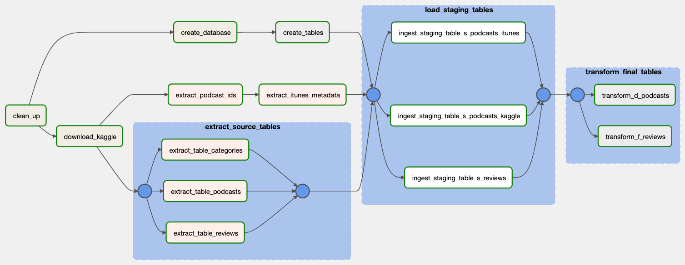

# Podcast reviews with iTunes metadata

TLDR: Examplary Airflow EtLT pipeline for OLAP with PostgreSQL in Docker as target database for local development.

This project demonstrates an EtLT pipeline using `Airflow`, `Docker` and `PostgreSQL` for enriching the existing [Kaggle Podcast Reviews dataset](https://www.kaggle.com/thoughtvector/podcastreviews) with additional metadata, requested from the iTunes API. The pipeline is built with modularity in mind, e.g. for moving the pipeline to AWS `Amazon Managed Workflows for Apache Airflow`, `Redshift` and `S3`.

## Data sources

The repository uses the following two data sources:
- The [Kaggle Podcast Reviews dataset](https://www.kaggle.com/thoughtvector/podcastreviews) containing ~ 1.3M reviews for ~50k podcasts.
- The [iTunes Lookup API](https://developer.apple.com/library/archive/documentation/AudioVideo/Conceptual/iTuneSearchAPI/index.html) for retrieving additional podcasts metadata (such as explicitness).

## Data pipeline

Below DAG gives a high-level overview of the process flow.



| Pipeline step | Description
| ------------- | -----------
| `clean_up` | An optional clean-up step removes any existing database container (if present) as well as tables and iTunes staging data (mainly for development purposes).
| `download_kaggle` | Runs a `kaggl cli` command via `conda run` for downloading the Kaggle Podcasts dataset and writes it to the `KAGGLE_STAGING_DIR`. The dataset comes as a SQLite database.
| `create_database` | Starts a `PostgreSQL Docker` container with configured database name, user and password. Also exposes necessary ports and mounts the host machines `BASE_STAGING_DIR` to the container in order for PostgreSQL to access the staging data to run server-side ingests.
| `create_tables` | Creates the datamodel with staging tables and final star schema from `.dags//sql/create_tables.sql`.
| `extract_source_tables` (task group) | Extracts the individual tables (reviews, podcasts, categories) from the SQLite Kaggle database and applies necessary preprocessing steps, such as removing non-ascii and special characters from strings, and writes them to individual CSV files in the `TABLES_STAGING_DIR`.
| `extract_podcast_ids` | Extracts unique podcast `itunes_ids` from the podcasts source table and writes them to CSV in the `TABLES_STAGING_DIR`.
| `extract_itunes_metadata` | Extracts metadata for each unique podcast iTunes id via the `iTunes Lookup API`. Processes the ids asynchronously in a single thread and writes each response to a JSON file in the `ITUNES_STAGING_DIR`.
| `load_staging_tables` (task group) | Ingests pre-processed tables from CSV to PostgreSQL staging tables `s_reviews`, `s_podcasts_kaggle` and `s_categories` using `COPY FROM` bulk-ingest for each CSV file. Ingests the iTunes metadata JSON files file by file into `s_podcasts_itunes`.
| `transform_final_tables` | Transforms the staging tables into the final fact table `f_reviews` and dimension table `d_podcasts` by joining the iTunes and Kaggle staging tables.

## Data model

The pipeline produces a single fact table `f_reviews` and a single dimension table `d_podcasts` which may be joined using the `itunes_id`:

Fact **f_reviews**:
- review_id serial primary key
- itunes_id varchar not null
- title varchar
- content varchar
- rating float
- author_id varchar
- created_at timestamp

Dimension **d_podcasts**:
- itunes_id varchar not null primary key
- slug varchar
- title varchar
- artist_name varchar not null
- price float
- genres varchar []
- primary_genre varchar
- explicitness varchar
- advisory_rating varchar
- track_count integer
- country varchar
- release_date timestamp

## Example analyis

The pipeline enriches the original [dataset](#data-sources) with additional podcasts metadata, such as explicitness, number of tracks and release date. Accordingly, analysis may be performed based on this metadata. An examplary question might be: *What is the average rating by advisory rating?*

Query:
```sql
select p.advisory_rating, avg(r.rating) as average_rating
from f_reviews as r
left join d_podcasts as p
on r.itunes_id = p.itunes_id
where r.itunes_id in (select itunes_id from d_podcasts)
group by p.advisory_rating
```

Result:
| advisory_rating | average_rating
| --------------- | --------------
| Clean	| 4.21
| Explicit | 4.78

## Setup
To run the pipeline for generating the dataset, the following steps are required:

0. Create and download [Kaggle](#Kaggle) API credentials
1. Create [Python environment](#Environment)
2. Set up [Airflow](#Airflow)
3. Make sure `Docker` is up and running

### Kaggle
Create a Kaggle account and download the key JSON file [as described here](https://www.kaggle.com/docs/api). The directory where this file is stored needs to match the `KAGGLE_CONFIG_DIR` in the configuration in the next step.

### Configuration
Create `.env` file with project configuration (see `.env_example`).

### Python environment
Setup environment and install the dependencies, e.g. via `miniconda`:
```bash
source .env
conda env create -n $CONDA_ENV_NAME pip
conda activate $CONDA_ENV_NAME
pip install -r requirements.txt
```

### Airflow standalone
- Start up airflow  and `AIRFLOW_HOME`:
```
export AIRFLOW_HOME=<airflow-home>
airflow standalone
```
- Add the `.dags` and `./plugins` folder to `airflow.cfg`
- Configure a airflow PostgreSQL connection on [Airflow UI - Connections](http://localhost:8080/connection/add)

## Running the pipeline
After completing the [setup](#setup), the DAG can be viewed and triggered on the [Airflow UI](http://localhost:8080).

## Performance and scalability considerations
The project is currently built to run on `Airflow standalone` with `PostgreSQL` as the target database running in a `Docker` container. This setup is primarily meant for local development and testing purposes, as well as running ad-hoc queries for offline analysis. 

### Bottlenecks

The major bottleneck step in the pipeline is the `extract_itunes_metadata` task, which runs REST API calls for all distinct podcast ids (~ 50k in the original Kaggle dataset) and serializes the results to JSON files. The current implementation handles this single-threaded andasynchronously, but with unnecessary amount of file I/O and a lot of room for higher level of concurrency.

One possible approach to overcome this is by using `Spark`, which may run these REST API calls concurrently in many threads across multiple workers and cores. More specifically, [one approach](https://medium.com/geekculture/how-to-execute-a-rest-api-call-on-apache-spark-the-right-way-in-python-4367f2740e78) is to define a `Python UDF` that handles the API call along with a `withColumn` statement to build a single dataframe containing all responses. The results may be written directly to a single `NDJSON` file on a remote storate to be bulk-ingestd to the final database. Going even further, the file may be sharded (or partitioned in the case of Spark) for more efficient ingest process. Alternative frameworks such as `Dask` for implementing a similar logic may also be considered.
`PostgreSQL` is able to handle all bulk ingests within seconds and returns single-join aggregate queries in sub-second ranges on a single machine.

### Additional scenarios
For further scalability and performance aspects, the following scenarios are considered:

1. The data is increased by 100x.
More volume may be handled well simply by changing the infrastructure the pipeline is running on:
- Moving to managed Airflow `MWAA`
- For the extract steps, either: Running the critical extract steps on larger `EC2` instances
- Or re-writing the logic in Spark and running on e.g. `EMR` or `Glue`
- Moving from PostgreSQL to `Redshift` for built-in horizontal scalability

2. The data populates a dashboard that must be updated on a daily basis by 7am every day.
The pipeline is built in Airflow, which means specifying a schedule is already considered in the intial design. For connecting a Dashboard, managed solutions such as `QuickSight` can connect directly to the target database, e.g. after migrating the PostgreSQL to a managed version such as `RDS`. Any required materialized tables may be built on top of the existing pipeline in an additional schema.

3. The database needs to be accessed by 100+ people.
Since the expected use is OLAP, `Redshift` should be able to handle concurrent read access well enough without sacrificing too much on query performance and latency.
